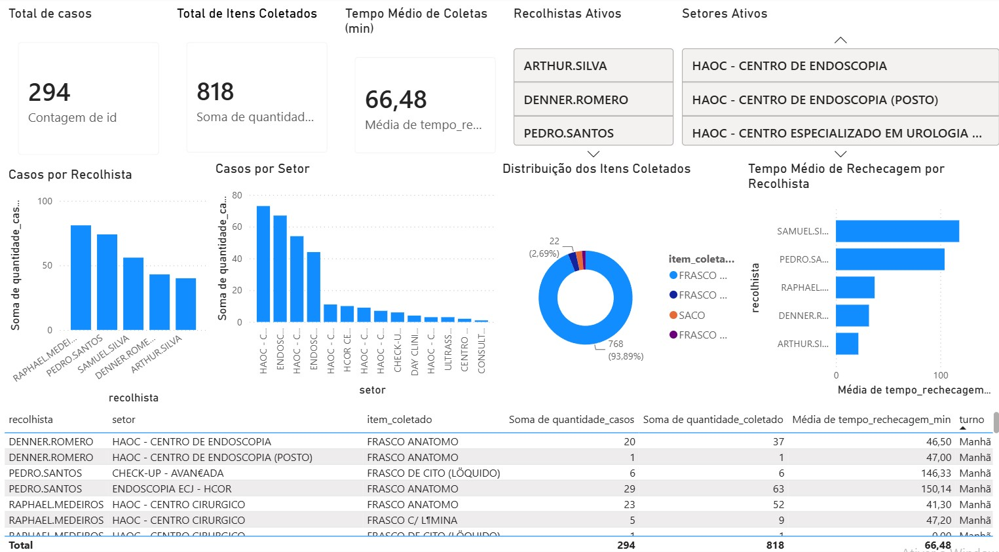

# 📊 CICAP BI Dashboard

Dashboard de Business Intelligence desenvolvido utilizando **MySQL** e **Power BI** para análise operacional de coletas laboratoriais.

---

## 📌 Objetivo

O objetivo deste projeto é transformar dados operacionais de coletas laboratoriais em informações estratégicas por meio de consultas SQL e visualizações no Power BI.

O dashboard permite acompanhar indicadores de produtividade, desempenho operacional e tempo médio de processamento das coletas.

---

## 🚀 Tecnologias Utilizadas

- MySQL
- SQL
- Power BI
- DAX
- Git
- GitHub

---

## 📂 Estrutura do Projeto

```text
cicap-bi-dashboard/
│
├── sql/
├── powerbi/
├── imagens/
├── dados/
└── README.md
```

---

## 🗄️ Banco de Dados

Tabela principal:

- **coletas**

Principais campos:

- recolhista
- setor
- item_coletado
- quantidade_coletado
- quantidade_casos
- data_coleta
- data_rechecagem
- tempo_rechecagem_min
- hora_coleta
- turno

---

## 📈 Indicadores Desenvolvidos

- Total de Coletas
- Total de Casos
- Total de Itens Coletados
- Tempo Médio de Rechecagem
- Ranking de Recolhistas
- Ranking de Setores
- Distribuição dos Itens Coletados
- Casos por Turno

---

## 📊 Dashboard

> Adicione abaixo uma captura de tela do dashboard.



---

## ▶️ Como Executar

1. Criar o banco de dados utilizando o script `01_criar_banco.sql`.
2. Criar a tabela utilizando o script `02_criar_tabela.sql`.
3. Importar o arquivo CSV para a tabela `coletas`.
4. Executar o script `03_tratamento_dados.sql`.
5. Executar o script `04_views.sql`.
6. Abrir o arquivo `Dashboard_CICAP.pbix` no Power BI Desktop.

---

## 👨‍💻 Autor

**Raphael Angenendt**

Projeto desenvolvido para fins de estudo e demonstração de habilidades em SQL, MySQL e Power BI.